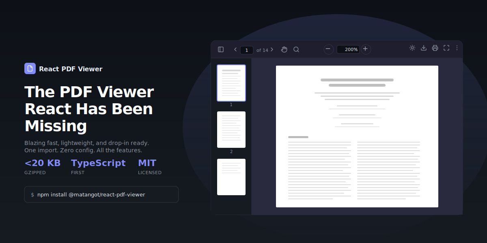

<p align="center">
  
</p>

<h1 align="center">React PDF Viewer</h1>

<p align="center">
  A fast, customizable React PDF viewer component powered by pdf.js.<br/>
  Works with Next.js, Vite, CRA, and any React environment.
</p>

<p align="center">
  <a href="https://www.npmjs.com/package/@matangot/react-pdf-viewer"></a>
  <a href="https://www.npmjs.com/package/@matangot/react-pdf-viewer"></a>
  <a href="https://github.com/matangot/react-pdf-viewer/blob/master/LICENSE"></a>
</p>

## Features

- Navigation (prev/next, page jump, keyboard shortcuts)
- Zoom (in/out, fit-width, fit-page)
- Search with match highlighting
- Download with custom filename
- Print
- Full screen
- Rotation
- Thumbnail sidebar
- Light/dark/system theme
- Compound components for full layout control
- CSS custom properties for easy theming

## Installation

```bash
npm install @matangot/react-pdf-viewer react react-dom pdfjs-dist
```

### Setup pdf.js worker

```ts
import { GlobalWorkerOptions } from 'pdfjs-dist';

GlobalWorkerOptions.workerSrc = new URL(
  'pdfjs-dist/build/pdf.worker.min.mjs',
  import.meta.url
).toString();
```

## Quick Start

```tsx
import { PdfViewer } from '@matangot/react-pdf-viewer';
import '@matangot/react-pdf-viewer/styles.css';

function App() {
  return (
    <PdfViewer
      src="https://example.com/document.pdf"
      defaultPage={1}
      defaultZoom="fit-width"
      theme="system"
    />
  );
}
```

## Compound Components

For full control over layout and which actions to show:

```tsx
import { PdfViewer } from '@matangot/react-pdf-viewer';
import '@matangot/react-pdf-viewer/styles.css';

function CustomViewer() {
  return (
    <PdfViewer.Root src={pdfUrl} theme="dark">
      <PdfViewer.Toolbar>
        <PdfViewer.Navigation />
        <PdfViewer.Separator />
        <PdfViewer.Zoom />
        <PdfViewer.Separator />
        <PdfViewer.Download fileName="report.pdf" />
        <PdfViewer.Print />
        <PdfViewer.FullScreen />
      </PdfViewer.Toolbar>
      <PdfViewer.Pages />
    </PdfViewer.Root>
  );
}
```

## Programmatic Access

```tsx
import { usePdfViewer } from '@matangot/react-pdf-viewer';

function CustomControls() {
  const { currentPage, totalPages, zoomIn, goToPage } = usePdfViewer();

  return (
    <div>
      <span>Page {currentPage} of {totalPages}</span>
      <button onClick={zoomIn}>Zoom In</button>
      <button onClick={() => goToPage(1)}>Go to First Page</button>
    </div>
  );
}
```

## Props

### `<PdfViewer>` / `<PdfViewer.Root>`

| Prop | Type | Default | Description |
|------|------|---------|-------------|
| `src` | `string \| File \| ArrayBuffer \| Uint8Array` | — | PDF source (required) |
| `defaultPage` | `number` | `1` | Initial page |
| `defaultZoom` | `number \| 'fit-width' \| 'fit-page'` | `1` | Initial zoom |
| `theme` | `'light' \| 'dark' \| 'system'` | `'system'` | Color theme |
| `onPageChange` | `(page: number) => void` | — | Page change callback |
| `onDocumentLoad` | `(info: DocumentInfo) => void` | — | Document load callback |
| `className` | `string` | — | Additional CSS class |

### `<PdfViewer.Download>`

| Prop | Type | Description |
|------|------|-------------|
| `fileName` | `string` | Override downloaded file name |

## Theming

Override CSS custom properties to customize the look:

```css
.pdf-viewer {
  /* Colors */
  --pdf-primary: #18181b;
  --pdf-primary-hover: #27272a;
  --pdf-bg: #fafafa;
  --pdf-text: #18181b;
  --pdf-text-muted: #71717a;

  /* Toolbar */
  --pdf-toolbar-bg: #f0f0f2;
  --pdf-toolbar-border: #e4e4e7;

  /* Buttons */
  --pdf-btn-hover: #f4f4f5;
  --pdf-btn-active: #e4e4e7;

  /* Inputs */
  --pdf-input-bg: #ffffff;
  --pdf-input-border: #d4d4d8;
  --pdf-input-focus-border: #71717a;

  /* Sidebar */
  --pdf-sidebar-bg: #f0f0f2;
  --pdf-sidebar-width: 180px;

  /* Pages */
  --pdf-page-bg: #ffffff;
  --pdf-page-shadow: 0 1px 2px rgba(0, 0, 0, 0.06);
  --pdf-page-gap: 12px;
  --pdf-placeholder-bg: #f4f4f5;

  /* Search */
  --pdf-search-highlight: #fde68a;

  /* Thumbnails */
  --pdf-thumbnail-border: transparent;
  --pdf-thumbnail-active-border: var(--pdf-primary);

  /* Dropdowns */
  --pdf-dropdown-bg: #ffffff;
  --pdf-dropdown-border: #d4d4d8;
  --pdf-dropdown-shadow: 0 4px 16px rgba(0, 0, 0, 0.12), 0 1px 4px rgba(0, 0, 0, 0.08);
  --pdf-dropdown-hover: #f4f4f5;
  --pdf-dropdown-icon: #52525b;
}
```

For a completely custom look, skip importing `styles.css` and style from scratch using the BEM class names.

## Keyboard Shortcuts

| Shortcut | Action |
|----------|--------|
| `Arrow Left` / `Page Up` | Previous page |
| `Arrow Right` / `Page Down` | Next page |
| `h` | Toggle cursor mode (text select / hand) |
| `Ctrl/Cmd + =` | Zoom in |
| `Ctrl/Cmd + -` | Zoom out |
| `Ctrl/Cmd + 0` | Reset zoom |
| `Ctrl/Cmd + F` | Open search |
| `Enter` | Next search match |
| `Shift + Enter` | Previous search match |
| `Escape` | Close search / modal / menu |

## Support

<a href="https://www.buymeacoffee.com/matangot" target="_blank"></a>

## License

MIT
